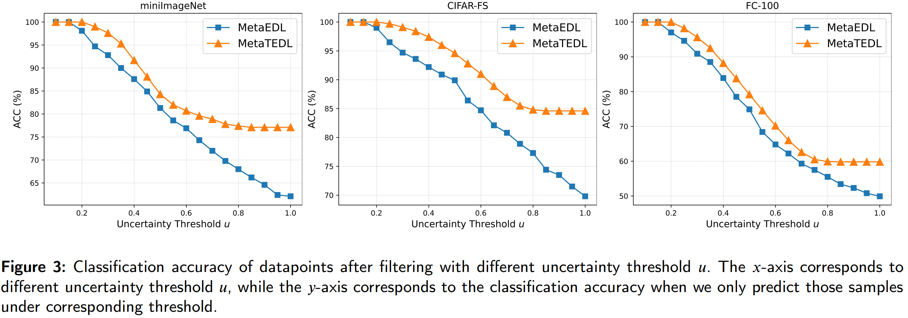

# Meta Transfer Evidence Deep Learning for Trustworthy Few-Shot Classification

This repository is an implementation of our paper "Meta Transfer Evidence Deep Learning for Trustworthy Few-Shot
Classification" in PyTorch. We propose a method called **<u>MetaTEDL</u>**, aiming at enhancing (1)
prediction accuracy; (2) uncertainty quantification capacity (UQ) performance; (3) OOD detection performance; and (4)
Active learning efficiency of Evidential Neural Network (ENN), in the few-shot scenarios.

In this work, we observe that evidence information sources are often
multi-modal. Therefore, during the meta-transfer-training phase, we attempt to integrate evidence from different sources, namely
pre-training and meta-training evidence, with the goal of improving the quality of the evidence output. Additionally, in the meta-transfer-training stage, we learn lightweight Scaling and Shifting (SS) parameters for the transferred pre-trained feature extractors to
mitigate the risk of overfitting.

The overview of MetaTEDL is shown as following:


The details of the MetaTEDL model are described in our paper.

## Table of contents

- [Requirements](#requirements)
- [Data and checkpoints preparation](#Data-and-checkpoints-preparation)
- [(a) Within-domain classification accuracy](#a-Within-domain-classification-accuracy)
- [(b) Cross-domain classification accuracy](#b-Cross-domain-classification-accuracy)
- [(c) Aleatoric uncertainty estimation](#c-Aleatoric-uncertainty-estimation)
- [(d) Epistemic uncertainty estimation](#d-Epistemic-uncertainty-estimation)
- [(e) OOD detection](#e-OOD-detection)
- [(f) Active learning](#f-Active-learning)
- [(g) Re-train MetaTEDL on miniImageNet by an end-to-end manner](#g-Re-train-MetaTEDL-on-miniImageNet-by-an-end-to-end-manner)
  - [Stage (1) Pre-training stage](#Stage-1-Pre-training-stage)
  - [Stage (2) Meta-transfer-learning stage](#Stage-2-Meta-transfer-learning-stage)
  - [Stage (3) Meta-testing stage](#Stage-3-Meta-testing-stage)
- [(h) Balance Factor Selection](#h-Balance-Factor-Selection)
- [Thanks](#Thanks)
- [Cite us](#Cite-us)

## Requirements

- torch==1.10.0+cu113
- torchvision==0.11.1+cu113
- Numpy==1.21.4
- learn2learn==0.1.7
- Scikit-learn==1.3.2


## Data and checkpoints preparation

In this work, we primarily use five commonly used benchmark
datasets: [miniImageNet](https://proceedings.neurips.cc/paper/2016/hash/90e1357833654983612fb05e3ec9148c-Abstract.html), [CIFAR-FS](https://arxiv.org/abs/1805.08136), [FC-100](https://proceedings.neurips.cc/paper/2018/hash/66808e327dc79d135ba18e051673d906-Abstract.html), [CUB](https://authors.library.caltech.edu/27452/?utm_campaign=The%20Batch&utm_source=hs_email&utm_medium=email&_hsenc=p2ANqtz--Sx1nvaahZe38-PWjKtUaD7qc__1GepLnIdt39_cou747ve6R6_mI2mgUTn45sU0V089Fp)
and [Places](https://link.springer.com/chapter/10.1007/978-3-031-20053-3_40).

**Data preparation:** Due to the large size of the pre-processed dataset (~17.4GB), we have stored
it [here](https://drive.google.com/file/d/1JTlFxJ9F7FIHubC6E7vzCebLk3rvpTvd/view?usp=drive_link). Please download this
zip file and extract it to the main directory as the `/dataset` folder.

- The explanation for the `/dataset` directory:
    - Each dataset is stored in its respective folder according to its name, for example `dataset/miniImageNet`.
    - Each dataset is divided into train, validation, and test sets, according to the proportions specified in
      Table 1 of the paper. Meanwhile, the original RGB images have been normalized and stored in `.pkl` files in the
      form of Numpy arrays, along with their corresponding labels as follows.
    - `dataset_train.pkl = {'data':[image_1, image_2, ..., image_n], 'label': [label_1, label_2, ..., label_n]}`
    - For specific loading methods and the generation of n-way k-shot few-shot tasks, please refer to the data loading
      script [mini_imagenet.py](data%2Fmini_imagenet.py).

**Checkpoints preparation:** The models trained on the three benchmarks, miniImageNet, CIFAR-FS and FC100, have been saved. Please download them from [here](https://drive.google.com/file/d/1M98CyQDQkls1tX0qpiVRONMAn6TtX8vt/view?usp=drive_link) and extract them to the `/checkpoints` folder.

- The explanation for the `/checkpoints` directory:
  - The model pre-trained on each dataset (using cross-entropy loss) is stored in its respective folder, for example `checkpoints/pre/miniImageNet`.
  - The model meta-trained on each dataset (using evidence loss) is stored in its respective folder, for example `checkpoints/meta/miniImageNet-5-shot`.

## (a) Within-domain classification accuracy

Run the script **[WithinDomainAccPerformance.py](WithinDomainAccPerformance.py)** for within-doamin classification.

- Here, we perform meta-transfer-training on the model using miniImageNet, CIFAR-FS, and FC-100.
- Then, we generate few-shot (5-way-1-shot and 5-way-5-shot) tasks on the corresponding datasets to serve as
  within-domain test tasks for evaluating the model's prediction accuracy.
- For the detailed description, please refer to **4.2 Prediction accuracy performance** in the paper.
- Commands for miniImageNet:
  ```bash 
  python WithinDomainAccPerformance.py --dataset miniImageNet --shot 1
  ```
  ```bash 
  python WithinDomainAccPerformance.py --dataset miniImageNet --shot 5
  ```
- Commands for CIFAR-FS:
  ```bash 
  python WithinDomainAccPerformance.py --dataset CIFAR-FS --shot 1
  ```
  ```bash 
  python WithinDomainAccPerformance.py --dataset CIFAR-FS --shot 5
  ```
- Commands for FC-100:
  ```bash 
  python WithinDomainAccPerformance.py --dataset FC-100 --shot 1
  ```
  ```bash 
  python WithinDomainAccPerformance.py --dataset FC-100 --shot 5
  ```
- Please note that due to environmental differences, there may be some deviations in the results. However, we believe
  that the deviation should remain within `± 1%` of the results reported in Table 2 of the paper.

<details>
  <summary>Click here for the results!</summary>


</details>

## (b) Cross-domain classification accuracy

Run the script **[CrossDomainAccPerformance.py](CrossDomainAccPerformance.py)** for cross-doamin classification.

- Here, the model is trained on miniImageNet.
- Then, we sample few-shot tasks from the CUB and Places datasets to perform fast-adaptation, in order to
  evaluate the model's cross-domain generalization performance.
- For the detailed description, please refer to **4.2 Prediction accuracy performance** in the paper.
- Commands for CUB:
  ```bash 
  python CrossDomainAccPerformance.py --dataset CUB --shot 1
  ```
  ```bash 
  python CrossDomainAccPerformance.py --dataset CUB --shot 5
  ``` 
- Commands for Places:
  ```bash 
  python CrossDomainAccPerformance.py --dataset Places --shot 1 --update_step 400
  ```
  ```bash 
  python withinDomainAccPerformance.py --dataset CIFAR-FS --shot 5
  ``` 
- Also, the deviation should remain within `± 1%` of the results reported in Table 3 of the paper.

<details>
  <summary>Click here for the results!</summary>


</details>

## (c) Aleatoric uncertainty estimation

Run the script **[AleatoricUncertaintyEstimation.py](AleatoricUncertaintyEstimation.py)** to evaluate the **aleatoric**
uncertainty estimation performance of MetaTEDL.

- Expected Calibration Error (ECE), is used as a metric for evaluating aleatoric uncertainty.
- The lower ECE indicates the better performance.
- In practice, we observed that different evidence fusion weights can significantly impact the model's predictive
  performance (Section 4.8 in the paper).
- Therefore, we dynamically adjust the evidence fusion coefficients, Eq (12) in the paper, to ensure the quality of the
  model's uncertainty assessment.
    - `--pretrain_evidence_weight` represents `μ_1`.
    - `--meta_evidence_weight` represents `μ_2`.
-
    - For the detailed description, please refer to **4.3 Aleatoric uncertainty estimation** in the paper.
- Commands for miniImageNet:
  ```bash 
  python AleatoricUncertaintyEstimation.py --dataset miniImageNet --shot 1 --pretrain_evidence_weight 100 --meta_evidence_weight 1000 --annealing_step 100 --update_step 500
  ```
  ```bash 
  python AleatoricUncertaintyEstimation.py --dataset miniImageNet --shot 5 --pretrain_evidence_weight 100 --meta_evidence_weight 1000 --annealing_step 100 --update_step 400
  ```
- Change the `--dataset` parameter to evaluate the performance on other datasets.
- The results are reported in Table 4 in the paper.

<details>
  <summary>Click here for the results!</summary>


</details>

## (d) Epistemic uncertainty estimation

Run the script **[EpistemicUncertaintyEstimation.py](EpistemicUncertaintyEstimation.py)** to evaluate the **epistemic**
uncertainty estimation performance of MetaTEDL.

- We use the uncertainty `u` in Eq. (3) as a metric to filter out trustworthy prediction datapoints.
- Intuitively, the prediction accuracy should improve as the uncertainty threshold decreases.
- For the detailed description, please refer to **4.4 Epistemic uncertainty estimation** in the paper.
- Commands for miniImageNet:
  ```bash 
  python EpistemicUncertaintyEstimation.py --dataset miniImageNet --shot 5 --threshold 0.5
  ```
    - `--threshold` represents the uncertainty threshold `u` used to filter datapoints.
    - Try to reduce it to `0.4, 0.3, ...` to obtain more trustworthy prediction results.
    - Change the argument `--dataset`  to evaluate the performance on other datasets.
- The results are reported in Figure 3 in the paper.

<details>
  <summary>Click here for the results!</summary>



</details>

## (e) OOD detection

Run the script **[OodDetection.py](OodDetection.py)** to evaluate the **OOD detection** performance of MetaTEDL.

- Here, we perform fast-adaption
  on the few-shot `ID` samples `(labeled 0)` from miniImageNet, CIFAR-FS and FC-100 datasets, respectively.
- Conversely, samples
  from Places dataset are used as `OOD` data `(labeled 1)`.
- Differential Entropy (Dent), Mutual Information (MI) and Precision (Prec) of predictive Dirichlet distribution are
  used as measures for `OOD` data.
- The area under the ROC curve (AUROC) of these metrics is reported.
- For the detailed description, please refer to **4.5 OOD detection** in the paper.
- Commands for miniImageNet:
  ```bash 
  python OodDetection.py --dataset miniImageNet --shot 1 --meta_base_lr 0.03 --pre_base_lr 0.03
  ```
  ```bash 
  python OodDetection.py --dataset miniImageNet --shot 5 --meta_base_lr 0.01 --pre_base_lr 0.01
  ```
- Commands for CIFAR-FS:
  ```bash 
  python OodDetection.py --dataset CIFAR-FS --shot 1 --meta_base_lr 0.06 --pre_base_lr 0.06
  ```
  ```bash 
  python OodDetection.py --dataset CIFAR-FS --shot 5 --meta_base_lr 0.01 --pre_base_lr 0.01
  ```
- Commands for FC-100:
  ```bash 
  python OodDetection.py --dataset FC100 --shot 1 --meta_base_lr 0.06 --pre_base_lr 0.06
  ```
  ```bash 
  python OodDetection.py --dataset FC100 --shot 5 --meta_base_lr 0.01 --pre_base_lr 0.01
  ```
- The results are reported in Table 5 in the paper.

<details>
  <summary>Click here for the results!</summary>


</details>

## (f) Active learning

Run the script **[ActiveLearning.py](ActiveLearning.py)** to evaluate the **Active learning** performance of MetaTEDL.

- Here, we select the samples with high uncertainty 𝑢 (i.e., hard to classify) for re-adaption and evaluate whether the
  model can “grow up” rapidly through these “hard samples”.
- Each task contains 5 support and 35 query samples, and we use the following two strategy for training.
    - **Explorative selection:** The top 5 samples exhibiting the highest uncertainty 𝑢 in each class of query set are
      transferred to support set, and then utilzed for re-adaption.
    - **Random selection:** Randomly selected transferred samples are used for comparison.
- For the detailed description, please refer to **4.6 Active Learning** in the paper.
- Commands for CIFAR-FS:
  ```bash 
  python ActiveLearning.py --dataset CIFAR-FS --seed 2
  ```
    - Change the argument `--shot` to include more training data.
    - Change the argument `--dataset` to evaluate the performance on other datasets.
- Tips:
    - As the model requires re-adaptation, we recommend a GPU memory size of at least `24GB`.
    - Adjust the random seed using `--seed` for active learning across different tasks.
    - The accuracy may vary across different tasks. However, we believe that the results based
      on `Explorative Selection` should generally outperform `Random Selection` in most tasks.
- The results are reported in Table 6 in the paper.

<details>
  <summary>Click here for the results!</summary>


</details>

## (g) Re-train MetaTEDL on miniImageNet by an end-to-end manner
Here, the MetaTEDL model will be retrained, which consists of three steps: (1) Pre-training stage, (2) Meta-transfer-learning stage, and (3) Meta-testing stage.

### Stage (1) Pre-training stage
In order to obtain powerful
feature extraction ability, we pre-train a large-scale model on the whole dataset by `cross-entropy loss`.

- Run the srcript [pretrain.py](pretrain.py) to pre-train a ResNet-12 feature extractor.
  ```bash 
  python pretrain.py --dataset miniImageNet --model_type ResNet --phase pre_train
  ```
- The pre-trained model will be saved as `log/pre/{dataset_with_hyperparameters}/max_acc.pth`
- Move this model into `checkpoints/pre/{dataset}/max_acc.pth`.
- Tip: The pre-trained models have been saved in the `/checkpoints/pre` folder.

### Stage (2) Meta-transfer-learning stage
Here, using `evidence loss`, we learn
two evidence headers and small-scale Scaling and Shifting
neural operators acting on the fixed feature extractor.

- Run the script [train.py](train.py) to meta-train the MetaTEDL model.
    ```bash 
    python train.py --dataset miniImageNet --model_type ResNet --phase meta_train
    ```
- The meta-trained model will be saved as `log/meta/{dataset_with_hyperparameters}/max_acc.pth`
- Move this model into `checkpoints/meta/{dataset-k-shot}/max_acc.pth`.

### Stage (3) Meta-testing stage
Re-run demo scripts (a)~(f) above for  MetaTEDL meta-testing, which includes:

- (1) Prediction accuracy performance
- (2) Uncertainty quantification (UQ) performance
- (3) OOD detection performance
- (4) Active learning efficiency

## (h) Balance Factor Selection

During the meta-transfer-training phase, MetaTEDL uses the evidence loss, Eq. (7) in the manuscript, to optimize model
parameters.

- This loss consists of two terms:
    - **The first term:** Multinominal expected loss, which is used to maximize evidence for the correct class.
    - **The second term:** KL divergence regularization term, which is used to force the output for incorrect classes to
      approach zero.
- A balance factor `λ_R` is used to adjust the proportion between the two terms.
- Note that we cannot simply increase the proportion of KL regularization terms to ensure correct classification. This
  is because some samples may have class overlap.
- In practice, we found that using a smaller `λ_R` early in training (encouraging the model to capture the evidence of
  each class) and a larger one later (reducing the evidence of incorrect classes) can significantly improve model
  performance.
  - For 1-shot tasks: `λ_R` is gradually increases from `0` to `0.5`.
  - For 5-shot tasks: `λ_R` is gradually increases from `0` to `0.75`.
- Please refer to [EDL_loss.py](models%2FEDL_loss.py) (line 67 ~ 70) for adjusting this coefficient ratio before meta-transfer-training:
  ```python
  annealing_coef = torch.min(
      torch.tensor(1.0, dtype=torch.float32),
      torch.tensor(epoch_num / annealing_step, dtype=torch.float32),
  )
  ```

## Thanks

Thanks for the support of the following repositories:

|                             Source                              |                     Detail                      |
|:---------------------------------------------------------------:|:-----------------------------------------------:|
|      https://github.com/yaoyao-liu/meta-transfer-learning       |    Implementation of Meta Transfer Learning     |
|           https://github.com/dragen1860/MAML-Pytorch            | Implementation of two-loop optimization of MAML |
| https://github.com/dougbrion/pytorch-classification-uncertainty |       Implement of Evidence Loss Function       |

## Cite us

If you find this work useful to you, please cite our paper:

```
@article{XXX,
  title={Meta Transfer Evidence Deep Learning for Trustworthy Few-Shot Classification},
  author={XXX},
  journal={XXX},
  year={2024}
}
```